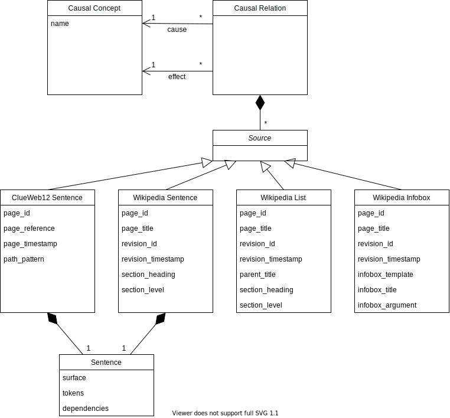

# CauseNet: Towards a Causality Graph Extracted from the Web

Causal knowledge is seen as one of the key ingredients to advance artificial intelligence. Yet, few knowledge bases comprise causal knowledge to date, possibly due to the significant efforts required to validate causal relations. Notwithstanding this challenge, we compile CauseNet, a large-scale knowledge base of *claimed* causal relations. By extraction from different semi- and unstructured web sources, we collect more than 11 million causal relations with an estimated extraction precision of 83\% and construct the first large-scale and open-domain causality graph. We analyze the graph to gain insights about causal beliefs expressed on the web and we demonstrate its usefulness for simple causal question answering. Future work might use the graph as test bench for algorithms for causal reasoning, argumentation, and complex question answering.

## Download

We provide three versions of our causality graph CauseNet:
- [CauseNet-Full](https://groups.uni-paderborn.de/wdqa/causenet/graphs/causenet-full.jsonl.bz2): The complete dataset
- [CauseNet-Precision](https://groups.uni-paderborn.de/wdqa/causenet/graphs/causenet-precision.jsonl.bz2): A subset of CauseNet-Full with higher precision
- [CauseNet-Sample](https://groups.uni-paderborn.de/wdqa/causenet/graphs/causenet-sample.json): A small sample dataset for first explorations and eperiments without provenance data

## Statistics

|                    | CauseNet-Full | CauseNet-Precision | CauseNet-Sample |
| -------------------| ------------: | -----------------: | --------------: |
| Number of relations|    11,608,812 |            196,481 |             264 |
| Number of concepts |    12,186,195 |             79,782 |             524 |
| Storage size       |         4.6GB |              322MB |            54KB |

## Data Model

The core of CauseNet consists of causal concepts which are connected by causal relations. Each causal relation has comprehensive provenance data on where and how it was extracted.



## Examples of Causal Relations


Causal relations are represented as shown in the following example. Provenance data is omitted.

```json
{
    "causal_relation": {
        "cause": {
            "concept": "disease"
        },
        "effect": {
            "concept": "death"
        }
    }
}
```

For CauseNet-Full and CauseNet-Precision, we include comprehensive provenance data. In the following, we give one example per source.

For relations extracted from natural language sentences we provide:
- `surface`: the surface form of the sentence, i.e., the original string  
- `tokens`: the tokenized surface form  
- `dependencies`: linguistic dependencies as determined with the Stanford NLP Parser  
- `path_pattern`: the linguistic path pattern used for extraction  

### ClueWeb12 Sentences

- `clueweb12_page_id`: page id as provided in the ClueWeb12 corpus
- `clueweb12_page_reference`: page reference as provided in the ClueWeb12 corpus  
- `clueweb12_page_timestamp`: page access data as stated in the ClueWeb12 corpus

```json
{
    "causal_relation": {
        "cause": {
            "concept": "smoking"
        },
            "effect": {
                "concept": "disability"
            }
    },
    "sources": [
        {
            "type": "clueweb12_sentence",
            "payload": {
                "clueweb12_page_id": "urn:uuid:4cbae00e-8c7f-44b1-9f02-d797f53d448a",
                "clueweb12_page_reference": "http://atlas.nrcan.gc.ca/site/english/maps/health/healthbehaviors/smoking",
                "clueweb12_page_timestamp": "2012-02-23T21:10:45Z",
                "sentence": {
                    "surface": "In Canada, smoking is the most important cause of preventable illness, disability and premature death.",
                    "tokens": ["In","Canada",",","smoking","is","the","most","important","cause","of","preventable","illness",",","disability","and","premature","death","."],
                    "dependencies": "digraph  {\n  N_1 [label=\"In/IN-1\"];\n  N_2 [label=\"Canada/NNP-2\"];\n  N_3 [label=\",/,-3\"];\n  N_4 [label=\"smoking/NN-4\"];\n  N_5 [label=\"is/VBZ-5\"];\n  N_6 [label=\"the/DT-6\"];\n  N_7 [label=\"most/RBS-7\"];\n  N_8 [label=\"important/JJ-8\"];\n  N_9 [label=\"cause/NN-9\"];\n  N_10 [label=\"of/IN-10\"];\n  N_11 [label=\"preventable/JJ-11\"];\n  N_12 [label=\"illness/NN-12\"];\n  N_13 [label=\",/,-13\"];\n  N_14 [label=\"disability/NN-14\"];\n  N_15 [label=\"and/CC-15\"];\n  N_16 [label=\"premature/JJ-16\"];\n  N_17 [label=\"death/NN-17\"];\n  N_18 [label=\"./.-18\"];\n  N_2 -> N_1 [label=\"case\"];\n  N_8 -> N_7 [label=\"advmod\"];\n  N_9 -> N_17 [label=\"nmod:of\"];\n  N_9 -> N_2 [label=\"nmod:in\"];\n  N_9 -> N_18 [label=\"punct\"];\n  N_9 -> N_3 [label=\"punct\"];\n  N_9 -> N_4 [label=\"nsubj\"];\n  N_9 -> N_5 [label=\"cop\"];\n  N_9 -> N_6 [label=\"det\"];\n  N_9 -> N_8 [label=\"amod\"];\n  N_9 -> N_12 [label=\"nmod:of\"];\n  N_9 -> N_14 [label=\"nmod:of\"];\n  N_12 -> N_17 [label=\"conj:and\"];\n  N_12 -> N_10 [label=\"case\"];\n  N_12 -> N_11 [label=\"amod\"];\n  N_12 -> N_13 [label=\"punct\"];\n  N_12 -> N_14 [label=\"conj:and\"];\n  N_12 -> N_15 [label=\"cc\"];\n  N_17 -> N_16 [label=\"amod\"];\n}\n"
                },
                "path_pattern": "[[cause]]/N\t-nsubj\tcause/NN\t+nmod:of\t[[effect]]/N"
            }
        }
    ]
}
```

### Wikipedia Sentences

- `wikipedia_page_id`: the Wikipedia page id 
- `wikipedia_page_title`: the Wikipedia page title
- `wikipedia_revision_id`: the Wikipedia revision id of the last edit 
- `wikipedia_revision_timestamp`: the timestamp of the Wikipedia revision id of the last edit
- `section_heading`: the section heading where the sentence comes from  
- `section_level`: the level where the section heading comes from  

```json
{
    "causal_relation": {
        "cause": {
            "concept": "human_activity"
        },
            "effect": {
                "concept": "climate_change"
            }
    },
    "sources": [
        {
            "type": "wikipedia_sentence",
            "payload": {
                "wikipedia_page_id": "13109",
                "wikipedia_page_title": "Global warming controversy",
                "wikipedia_revision_id": "860220175",
                "wikipedia_revision_timestamp": "2018-09-19T04:52:18Z",
                "sentence_section_heading": "Global warming controversy",
                "sentence_section_level": "1",
                "sentence": {
                    "surface": "The controversy is, by now, political rather than scientific: there is a scientific consensus that climate change is happening and is caused by human activity.",
                    "tokens": ["The","controversy","is",",","by","now",",","political","rather","than","scientific",":","there","is","a","scientific","consensus","that","climate","change","is","happening","and","is","caused","by","human","activity","."],
                    "dependencies": "digraph  {\n  N_1 [label=\"The/DT-1\"];\n  N_2 [label=\"controversy/NN-2\"];\n  N_3 [label=\"is/VBZ-3\"];\n  N_4 [label=\",/,-4\"];\n  N_5 [label=\"by/IN-5\"];\n  N_6 [label=\"now/RB-6\"];\n  N_7 [label=\",/,-7\"];\n  N_8 [label=\"political/JJ-8\"];\n  N_9 [label=\"rather/RB-9\"];\n  N_10 [label=\"than/IN-10\"];\n  N_11 [label=\"scientific/JJ-11\"];\n  N_12 [label=\":/:-12\"];\n  N_13 [label=\"there/EX-13\"];\n  N_14 [label=\"is/VBZ-14\"];\n  N_15 [label=\"a/DT-15\"];\n  N_16 [label=\"scientific/JJ-16\"];\n  N_17 [label=\"consensus/NN-17\"];\n  N_18 [label=\"that/WDT-18\"];\n  N_19 [label=\"climate/NN-19\"];\n  N_20 [label=\"change/NN-20\"];\n  N_21 [label=\"is/VBZ-21\"];\n  N_22 [label=\"happening/VBG-22\"];\n  N_23 [label=\"and/CC-23\"];\n  N_24 [label=\"is/VBZ-24\"];\n  N_25 [label=\"caused/VBN-25\"];\n  N_26 [label=\"by/IN-26\"];\n  N_27 [label=\"human/JJ-27\"];\n  N_28 [label=\"activity/NN-28\"];\n  N_29 [label=\"./.-29\"];\n  N_2 -> N_1 [label=\"det\"];\n  N_2 -> N_3 [label=\"dep\"];\n  N_3 -> N_4 [label=\"punct\"];\n  N_4 -> N_6 [label=\"root\"];\n  N_6 -> N_5 [label=\"case\"];\n  N_6 -> N_7 [label=\"punct\"];\n  N_7 -> N_8 [label=\"root\"];\n  N_7 -> N_11 [label=\"root\"];\n  N_8 -> N_9 [label=\"cc\"];\n  N_8 -> N_11 [label=\"conj:negcc\"];\n  N_8 -> N_12 [label=\"punct\"];\n  N_8 -> N_29 [label=\"punct\"];\n  N_8 -> N_14 [label=\"parataxis\"];\n  N_9 -> N_10 [label=\"mwe\"];\n  N_14 -> N_17 [label=\"nsubj\"];\n  N_14 -> N_13 [label=\"expl\"];\n  N_17 -> N_16 [label=\"amod\"];\n  N_17 -> N_22 [label=\"ccomp\"];\n  N_17 -> N_25 [label=\"ccomp\"];\n  N_17 -> N_15 [label=\"det\"];\n  N_20 -> N_19 [label=\"compound\"];\n  N_22 -> N_18 [label=\"mark\"];\n  N_22 -> N_20 [label=\"nsubj\"];\n  N_22 -> N_21 [label=\"aux\"];\n  N_22 -> N_23 [label=\"cc\"];\n  N_22 -> N_25 [label=\"conj:and\"];\n  N_25 -> N_20 [label=\"nsubjpass\"];\n  N_25 -> N_24 [label=\"auxpass\"];\n  N_25 -> N_28 [label=\"nmod:agent\"];\n  N_28 -> N_26 [label=\"case\"];\n  N_28 -> N_27 [label=\"amod\"];\n}\n"
                },
                "path_pattern": "[[cause]]/N\t-nmod:agent\tcaused/VBN\t+nsubjpass\t[[effect]]/N"
            }
        }
    ]
}
```

### Wikipedia Lists

- `list_toc_parent_title`: The heading of the parent section the list appears in
- `list_toc_section_heading`: The heading of the section the list appears in
- `list_toc_section_level`: The nesting level of the section within the table of content (toc)

```json
{
    "causal_relation": {
        "cause": {
            "concept": "separation_from_parents"
        },
            "effect": {
                "concept": "stress_in_early_childhood"
            }
    },
    "sources": [
        {
            "type": "wikipedia_list",
            "payload": {
                "wikipedia_page_id": "33096801",
                "wikipedia_page_title": "Stress in early childhood",
                "wikipedia_revision_id": "859225864",
                "wikipedia_revision_timestamp": "2018-09-12T16:22:05Z",
                "list_toc_parent_title": "Stress in early childhood",
                "list_toc_section_heading": "Causes",
                "list_toc_section_level": "2"
            }
        }
    ]
}
```

### Wikipedia Infoboxes

- `infobox_template`: The Wikipedia template of the infobox
- `infobox_title`: The title of the Wikipedia infobox
- `infobox_argument`: The argument of the infobox (the key of the key-value pair)

```json
{
    "causal_relation": {
        "cause": {
            "concept": "alcohol"
        },
            "effect": {
                "concept": "cirrhosis"
            }
    },
    "sources": [
        {
            "type": "wikipedia_infobox",
            "payload": {
                "wikipedia_page_id": "21365918",
                "wikipedia_page_title": "Cirrhosis",
                "wikipedia_revision_id": "861860835",
                "wikipedia_revision_timestamp": "2018-09-30T15:40:21Z",
                "infobox_template": "Infobox medical condition (new)",
                "infobox_title": "Cirrhosis",
                "infobox_argument": "causes"
            }
        }
    ]
}
```


## Loading CauseNet into Neo4j

We provide [sample code](notebooks/load-into-neo4j.ipynb) to load CauseNet into the graph database [Neo4j](https://neo4j.com/).

The following figure shows an excerpt of CauseNet within Neo4j (showing a coronavirus causing the disease SARS):


## Concept Spotting Datasets

For the construction of CauseNet, we employ a causal concept spotter as a causal concept can be composed of multiple words (e.g., “global warming”, “human activity”, or “lack of exercise”). We determine the exact start and end of a causal
concept in a sentence with a sequence tagger. Our training and evaluation data is available as part of our [concept spotting datasets](https://groups.uni-paderborn.de/wdqa/causenet/concept-spotting): one for Wikipedia infoboxes, Wikipedia lists, and ClueWeb sentences. We split each dataset into 80% training, 10% development and 10% test set


## Contact

For questions and feedback please contact:

Stefan Heindorf, Paderborn University  
Yan Scholten, Paderborn University  
Henning Wachsmuth, Paderborn University  
Axel-Cyrille Ngonga Ngomo, Paderborn University  
Martin Potthast, Leipzig University  

## Licenses

The code is licensed under a [MIT license](https://opensource.org/licenses/MIT). The data is licensed under a [Creative Commons Attribution 4.0 International license](https://creativecommons.org/licenses/by/4.0/).
